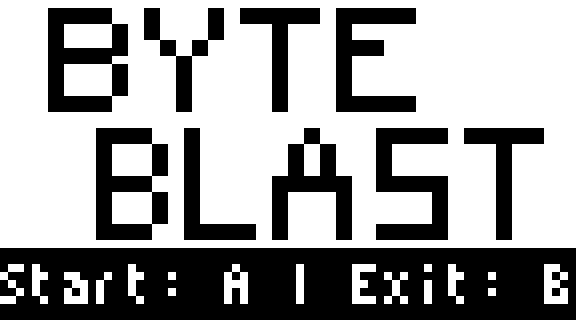
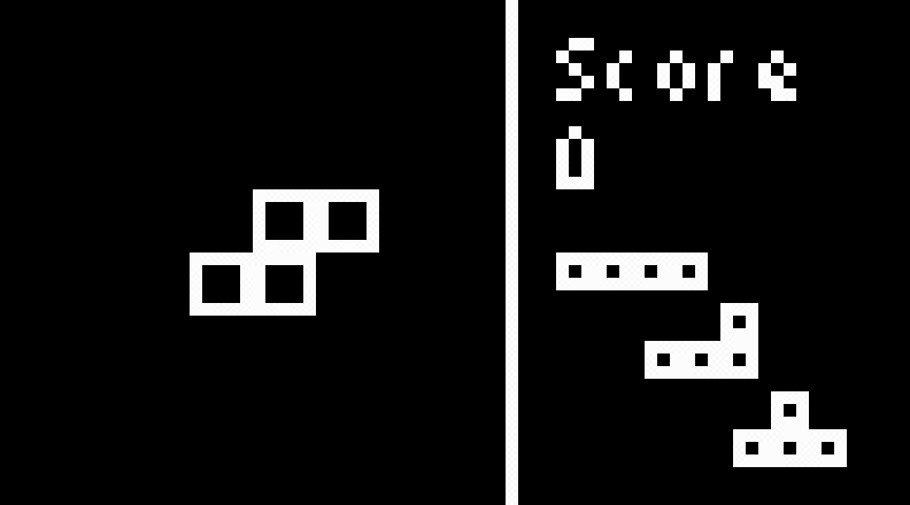

# Byte Blast

A compact Tetris-style puzzle game for the Thumby. Place tetrominoes on an 8 by 8 grid to clear rows and columns for points. The more lines you clear the higher your score! Keep going until you can't place anymore blocks. 
<!-- graphics showcase --> 

The longer you last the more points you score! Keep going and see how high you can make it! Try and manage high score combos with making room for pieces coming later in the queue.
